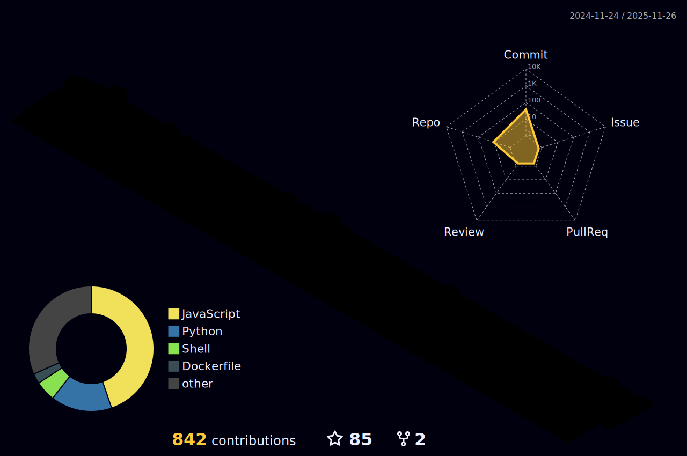

<!-- FINAL PROFESSIONAL README (ALL FIXED, ALL FEATURES WORKING) -->

  

<h1 align="center">Hi 👋, I'm Asliddin</h1>
<h3 align="center">Backend Developer · Python · Golang · DevOps Learner</h3>

---

## 🎨 Premium SVG Banner

  

---

## ✨ Typing Animated Skills

  

---

## 🧠 About Me
- Backend developer building scalable APIs
- Python, Golang, FastAPI, Django
- DevOps journey: Docker → CI/CD → Kubernetes
- Email: **asliddintukhtasinov5@gmail.com**

---

## 🛰 Real-time GitHub Metrics

  

  
  

---

## 📊 GitHub Stats (Auto Dark/Light)

  <picture>
    <source srcset="https://github-readme-stats.vercel.app/api?username=asliddintuxtasinov&show_icons=true&theme=radical" media="(prefers-color-scheme: dark)" />
    <source srcset="https://github-readme-stats.vercel.app/api?username=asliddintuxtasinov&show_icons=true&theme=default" media="(prefers-color-scheme: light), (prefers-color-scheme: no-preference)" />
    
  </picture>

  <picture>
    <source srcset="https://github-readme-stats.vercel.app/api/top-langs/?username=asliddintuxtasinov&layout=compact&theme=radical" media="(prefers-color-scheme: dark)" />
    <source srcset="https://github-readme-stats.vercel.app/api/top-langs/?username=asliddintuxtasinov&layout=compact&theme=default" media="(prefers-color-scheme: light), (prefers-color-scheme: no-preference)" />
    
  </picture>

---

## 🐍 Contribution Snake (Auto Updated)

---

## 🧊 3D Contribution Graph

  

---

## 🌐 Connect with Me

  
  
  

---

## 🧩 Fun
> "Clean Code is not a goal — it's a habit."
